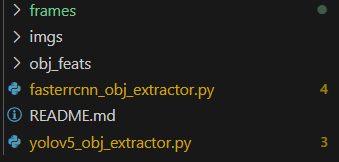

# YOLOv5_object_feature_extraction
*<u>Using yolov516.pth and fasterrcnn_resnet50_fpn_coco-258fb6c6.pth to extract object features.</u>*


# 1、Directory Structure

- You can put your files like this:



# 2、Setup Envs

```shell
git clone https://github.com/Yhc-777/YOLOv5_object_feature_extraction.git
cd YOLOv5_object_feature_extraction
conda create -n yolov5 python=3.8 -y
conda activate yolov5
pip install torch==1.11.0+cu113 torchvision==0.12.0+cu113 torchaudio==0.11.0 --extra-index-url https://download.pytorch.org/whl/cu113
pip install opencv-python h5py pandas
```

# 3、Object feature extraction demo

```shell
python yolov5_obj_extractor.py
python fasterrcnn_obj_extractor.py
```

- Then you can get ".h5" file.
